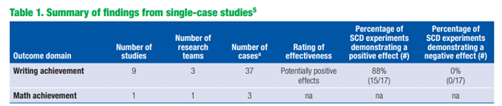

**BIG DISCLAIMER UP FRONT: These are just my opinions. They are not a reflection of anyone at IES or my colleagues doing work for SWAT contract.**

For anyone more than passingly familiar with the WWC’s Standards for reviewing SCD studies, they will likely know that the version 4.1 Standards were unpopular with a notable portion of the applied research community. As a part of the move to a fixed-effects meta-analysis framework for synthesizing SCDs, the “evidence standards” part of the Standards was removed in favor of characterizing evidence in terms of the between-case standardized mean difference, called the design-comparable effect size by the WWC. This meant that the Standards no longer included visual analysis. Given the centrality of visual analysis to how nearly all applied SCD researchers understand and analyze their studies, this was a big problem for a lot of them.

In my work on the WWC, I have had a lot of opportunity to discuss the Standards with researchers using SCDs, and I have some thoughts about those interactions.

First, my impression is that a non-trivial number of applied researchers don’t have a strong understanding of degree to which the “evidence review” part of the Handbook was not terribly consequential to whether an individual study was described as part of the “evidence base” by the WWC. If you look at the reviews of individual studies page and filter by SCDs and studies which met standards at any level, you won’t see the evidence rating listed anywhere. SCD studies were frequently not part of the primary findings of intervention reports because of the way the WWC interpreted the 5-3-20 rule. It has been implied in at least conversation I’ve witness that the WWC was using the 5-3-20 rule wrong. I don’t know how it was intended to be used, but the practical consequence of how it has been interpreted means that very few SCDs contribute to WWC intervention reports. In any case, there were plenty of intervention reports where there were no primary findings because although some SCDs met Standards, there weren’t enough within a given domain for the WWC to report on them, for instance the [System of Least Prompts intervention report](https://ies.ed.gov/ncee/wwc/Docs/InterventionReports/wwc_slp_101818.pdf).

Even when the SCD studies met the threshold for the WWC’s interpretation of the 5-3-20 rule, the evidence rating didn’t contribute in the way I think that SCD researchers would have liked it to. Take the primary summary table from the [Self-Regulated Strategy Development intervention report](https://ies.ed.gov/ncee/wwc/Docs/InterventionReports/wwc_srsd_111417.pdf>):

 

The “evidence review” stage ends up being fundamentally a vote-counting exercise in the final outcome analysis. Throughout the intervention report the document says to refer to appendix C for the visual analysis. If you’re an applied SCD researcher, you might expect some narrative discussion of the visual analysis. No. It’s just a summary of the evidence level (i.e., strong, moderate, no evidence), the total attempts to demonstrate a basic effect, and the number of successful attempts.

I would be willing to be that most applied SCD researchers would not be happy if a meta-analysis published in one of their journals operated this way. And yet…I’ve never personally heard any discussion of this problem. So, it seems likely to me that the objections to the WWC Standards don’t have much to do with the WWC *as such*.

So, what’s the fuss? Based on a lot of conversations I listened to at the conference, a lot of it is about publishing primary research. The published standards exert some pressure on published research, both group designs and SCDs in education. To some degree, this is by design. The WWC would like to help improve the quality of published research. However, there’s a trade-off here. The research and publication cycle is long, so stuff that you see published today may have started work three, four, five years ago. Maybe longer. A lot of this is research that IES itself funded. The WWC doesn’t want to punish researchers for doing something that was best practice when they started their work! This means there is some tension between the evocative effect of spurring better-quality research and the practical desire to include as much reasonable-quality research in the evidence base as possible. I also think there’s reason to be skeptical of the degree to which the WWC can drive primary research practice, except insofar as they influence IES-funded research.

But I digress. Prior to my time at the Spencer conference, my suspicion was that another reason for the focus on the WWC’s Standards was because there was a desire to exert control over what is seen as “real” or “good” visual analysis. This is a tricky problem, because the WWC’s Standards (across all designs) are mostly about study design and sometimes study conduct, and not about the study analysis. In fact, a group design study that was well-designed and executed but had garbage analysis could in theory find itself in the evidence base if it reported the right information. The tricky thing with SCDs is that the typical research process has a less clear distinction between the design, conduct, and analysis of studies. Many studies are “designed” as they go, in some sense, because the length of the phases and sometimes other elements of the design are contingent on the pattern of the data observed by the researcher. The applied methods work has not made a clear distinction between those elements of a study that are important for internal validity and those elements that are important for other reasons. I also think they have not made a clear distinction about internal validity for what kind of inference, but this is maybe a separate issue. There is also the problem that much of what applied researchers think of as internal validity checks are intimately connected to the expected or observed value of the intervention effect. Practically speaking, it’s easier for a study with a large effect to be considered “good” via visual analysis. If you’re a typical meta-analyst, you’re probably squirming in your seat right now. If you discard studies with small, null, and negative/contratherapeutic effects, you have the potential for serious publication bias issues.

So, to summarize, the WWC doesn’t want to try and dictate analysis and doesn’t really want to make analysis part of their screening. At the end of the day, the WWC’s Standards are Standards for inclusion into synthesis. There are things that aren’t a part of the standards for group designs that are important to writing a high-quality group design paper. I’m sympathetic to the idea that senior researchers want to encourage visual analysis best practices. I had assumed the objections to the remove of visual analysis was a problem of not encouraging all of the right things.
What had never been made clear to me before, but what became clear to me at the Spencer conference, was that a big part of the issue researchers took with the WWC Standards was that editors and reviewers treat the Standards prescriptively. If a study doesn’t meet the WWC Standards, it’s considered not worth publishing. The WWC Standards are in this way a straitjacket, rather than gentle evocative guidance for research practices. The natural extension of the worry about the WWC Standards as prescriptive standards is that editors and reviewers, seeing that it’s not a required part of the WWC review process, will no longer give careful consideration of the quality of visual analysis in their review process. A worse outcome from the perspective of many researchers that was never articulated but seems like the logical consequence of following this chain of reasoning is that editors or reviewers may decide that visual analysis should not be a part of the primary studies. Beyond the problem of editors and reviewers, graduate students designing their own studies may lean too heavily on the WWC’s Standards for what constitutes doing a study correctly, rather than thinking carefully about their research questions and the design that will support it.

At this point, it’s clear (to me) that there need to be better guidelines on the conduct of primary SCD studies and what editors and reviewers should focus on. Not every publishable SCD study needs to be ready for inclusion into synthesis. Evidence for a particular intervention as defined by the WWC is not the only kind of evidence of value. Plenty of development work that’s part of Goal 2 IES grants is probably worth sharing and publishing, but the qualitative or exploratory work might not qualify as “evidence” in the particular way the WWC focuses on (credit to Ann Kaiser here for pointing some of this out). Standards for primary SCD research will need to reflect this. Standards for primary research should also make clear the continuum of SCD research. Both the research that is “good enough” to be published, even if it isn’t the most rigorously designed and informative study, as well as the “very best” quality research that provides maximum information for the kind of question it’s trying to answer. (Note: This is not my point. Many people at the Spencer conference who were not me said this).

As Wendy Machalicek and others noted, there are many “competing” Standards for SCD research that have been published by a variety of research traditions. Traditions here reflect clusters of close collaborators and researchers who share an academic lineage (“academic parent” and “academic child” language weirds me out, but we’ll stick with it for the time being). Researchers common to a particular tradition tend to have a very clear shared understanding of what an SCD study should contain but may not overlap as cleanly with the conventions of another research tradition. However, it is quite likely that there are many more points of agreement than there are points of disagreement. Many points of disagreement may turn out to be semantic rather than substantive. And where there are substantive points of disagreement, it’s likely time there was broader cooperation across the various traditions represented in primary SCD research to articulate what those points of disagreement are and why they matter, alongside a clearer understanding of the shared research values across the traditions. 
